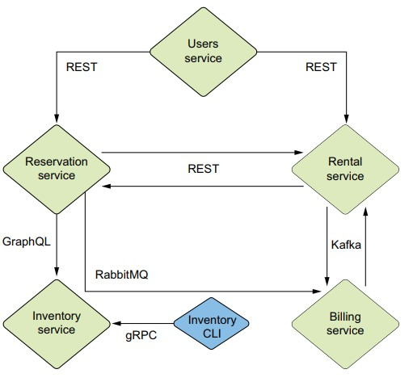

# The service offers car rental

The idea came from the book [Štefanko Martin, Martiška Jan - Quarkus in Action - 2025](https://developers.redhat.com/e-books/quarkus-action?extIdCarryOver=true&sc_cid=RHCTG0180000371695), and the implementation was carried out on the `Spring` platform. The goal is to check whether the implementation described in the book can be performed in `Quarkus` using traditional methods.

### The service consists of six components:

1. User service — user interface for clients.  (_in development_)
2. Reservation service — car reservation system.
3. Rental service is a service for starting and ending rentals.
4. Inventory service — a database of all vehicles in the fleet.
5. Billing service is a billing system for rent.
6. Inventory CLI is an administrative application for fleet management.

